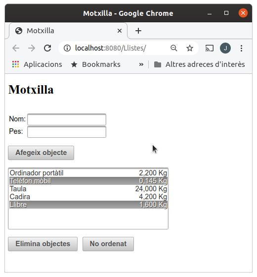
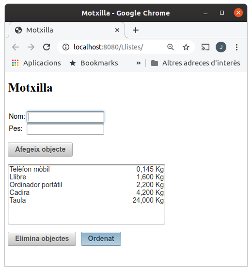

# Activitat 04. Llistes de seleccio multiple

En aquesta activitat farem una aplicació en què podrem afegir un objecte i el seu pes a una llista. Podrem seleccionar objectes de la llista i esborrar-los, i a més mostrar la llista ordenada pel pes. Tindrà un aspecte com el que es veu en la imatge.

| Amb elements seleccionats | Amb elements ordenats |
|---------------------------|-----------------------|
|  |  |

Per començar podeu fer part de l'aplicació seguint l'exemple Llista de selecció múltiple al Moodle de teoria. Després hi afegireu un botó que ens permetrà ordenar els elements de la llista i algunes millores en la visualització de la llista.

Podeu consultar com fer l'ordenació a la teoria de llistes.

Pera al botó d'ordenar, les columnes i el format dels números podeu consultar la web https://www.primefaces.org/showcase per a fer la pràctica. Necessitareu els elements <p:selectBooleanButton>, <p:column> i <f:convertNumber>.
